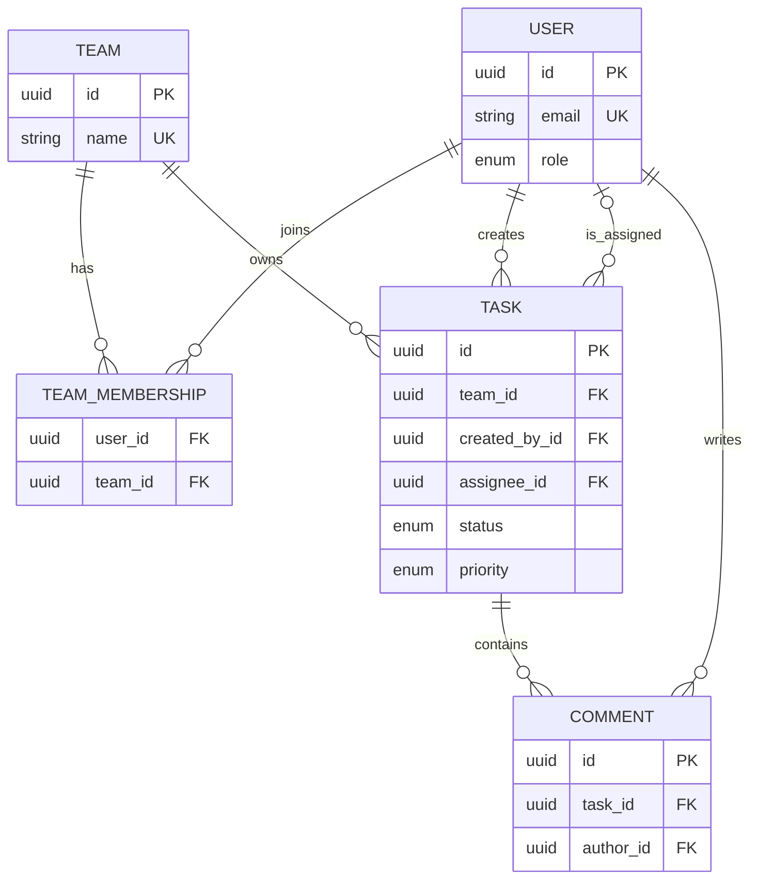

# Task Management API — Design Specification

## 1. Purpose

Build a small, production-style Task Management API during Days 4–14 of an 87-day Backend Engineer challenge. The project is a vehicle for learning backend architecture, REST, security, PostgreSQL/Prisma, Redis, background jobs, and testing in one coherent codebase.

This is a specification, not implementation code. Start small, make each layer earn its existence, and add features only when their scheduled learning day arrives.

## 2. Goals and scope

### Goals

- Users can register, sign in, and manage tasks they own.
- Managers can view and organize work for members of their team.
- Administrators can manage users and teams at a basic level.
- The API has clear boundaries: routes → controllers → services → repositories.
- It demonstrates sensible validation, error handling, authorization, persistence, caching, jobs, and tests.

### In scope

- JSON REST API; no frontend is required.
- Users, teams, memberships, tasks, comments, and audit-friendly timestamps.
- JWT-based authentication and role/team-based authorization.
- PostgreSQL with Prisma once persistence is introduced.
- Redis for deliberately chosen cache entries and BullMQ queues.

### Explicitly out of scope for this mini-project

- Real-time collaboration/websockets, file uploads, email-provider integration, recurring tasks, full-text search, multi-tenant billing, OAuth/SSO, and complex workflow customization.
- A separate microservice architecture. This should remain one modular API.

## 3. Roles and permissions

| Role | Main responsibility | Baseline permissions |
| --- | --- | --- |
| `USER` | Complete and track assigned work | Read/update own tasks; create tasks for self; comment on tasks they can access |
| `MANAGER` | Organize a team’s work | All USER capabilities plus create/assign/update/read tasks belonging to their team; view team members |
| `ADMIN` | Operate the application | Manage users, teams, and memberships; read/update any task |

Role is a **global application role**. Team membership supplies the team context. A manager must be a member of the target team before managing its tasks. Keep this rule in the service layer, not only in route middleware.

## 4. Functional requirements

1. Register and log in with email and password.
2. Read the authenticated user’s profile.
3. Create, read, update, list, and soft-delete tasks.
4. Filter task lists by status, priority, assignee, team, and due date; paginate results.
5. Assign a task to an eligible member of its team.
6. Change a task’s status using valid lifecycle transitions.
7. Add comments to accessible tasks.
8. Administrators manage users, teams, and memberships; managers may list members of their own teams.
9. Record a lightweight task activity trail only if time permits (for example, created, assigned, status changed).
10. Cache a read-heavy task-list or task-detail endpoint, then invalidate affected keys after writes.
11. Enqueue a background reminder for a task with a due date; a worker logs/sends a placeholder notification. Do not make external email delivery a requirement.

## 5. Non-functional requirements

- **Security:** hash passwords; never return password hashes; authenticate protected routes; authorize every resource access; validate untrusted input.
- **Correctness:** consistent UTC timestamps; transactions where one operation changes related records; stable pagination order.
- **API quality:** JSON responses, appropriate HTTP status codes, clear error shape, versioned `/api/v1` routes.
- **Observability:** structured request/error logs, request IDs, and no credentials/tokens in logs.
- **Performance:** indexes for common filters; bounded pagination; cache only data whose consistency trade-off is understood.
- **Maintainability:** one responsibility per layer and tests around business rules.

## 6. Core domain model

### Task lifecycle and priority

Statuses: `TODO`, `IN_PROGRESS`, `IN_REVIEW`, `DONE`, `CANCELLED`.

Recommended transitions:

```text
TODO → IN_PROGRESS → IN_REVIEW → DONE
TODO / IN_PROGRESS / IN_REVIEW → CANCELLED
CANCELLED → TODO                 (optional restore)
DONE → IN_PROGRESS               (reopen, if desired)
```

Do not allow arbitrary status strings. Enforce valid values through the database enum and validate the business transition in the service.

Priorities: `LOW`, `MEDIUM`, `HIGH`, `URGENT`; default `MEDIUM`. Priority describes importance, while `dueAt` describes time sensitivity.

### Entity relationships

- A `User` can belong to many `Team`s through `TeamMembership`.
- A `Team` has many members and many tasks.
- A `Task` belongs to one team, has one creator, and may have one assignee.
- A `Task` has many comments.
- A comment belongs to one task and one author.



## 7. Database design (PostgreSQL)

Use UUID primary keys (generated by the database or ORM), `timestamptz` for timestamps, and `snake_case` in the database. Prisma can map to its preferred application naming later.

### Enums

| Enum | Values |
| --- | --- |
| `user_role` | `USER`, `MANAGER`, `ADMIN` |
| `task_status` | `TODO`, `IN_PROGRESS`, `IN_REVIEW`, `DONE`, `CANCELLED` |
| `task_priority` | `LOW`, `MEDIUM`, `HIGH`, `URGENT` |

### `users`

| Column | Type | Constraints / notes |
| --- | --- | --- |
| `id` | `uuid` | PK, generated |
| `email` | `varchar(255)` | required, unique; normalize to lowercase before storage |
| `password_hash` | `varchar(255)` | required; never expose |
| `name` | `varchar(100)` | required |
| `role` | `user_role` | required, default `USER` |
| `is_active` | `boolean` | required, default `true` |
| `created_at`, `updated_at` | `timestamptz` | required |

Indexes: unique index on `email`; optional index on `(role, is_active)` only if admin listing needs it.

### `teams`

| Column | Type | Constraints / notes |
| --- | --- | --- |
| `id` | `uuid` | PK |
| `name` | `varchar(100)` | required, unique for this learning project |
| `description` | `varchar(500)` | nullable |
| `created_at`, `updated_at` | `timestamptz` | required |

### `team_memberships`

| Column | Type | Constraints / notes |
| --- | --- | --- |
| `user_id` | `uuid` | required FK → `users.id`, cascade delete |
| `team_id` | `uuid` | required FK → `teams.id`, cascade delete |
| `created_at` | `timestamptz` | required |

Primary key: composite `(user_id, team_id)`. Index `(team_id, user_id)` supports team-member authorization checks.

### `tasks`

| Column | Type | Constraints / notes |
| --- | --- | --- |
| `id` | `uuid` | PK |
| `title` | `varchar(200)` | required |
| `description` | `text` | nullable |
| `status` | `task_status` | required, default `TODO` |
| `priority` | `task_priority` | required, default `MEDIUM` |
| `due_at` | `timestamptz` | nullable |
| `team_id` | `uuid` | required FK → `teams.id`; restrict deletion while tasks exist |
| `created_by_id` | `uuid` | required FK → `users.id`; restrict deletion |
| `assignee_id` | `uuid` | nullable FK → `users.id`; set null on user removal, if removals are allowed |
| `completed_at` | `timestamptz` | nullable; set when status becomes `DONE` |
| `deleted_at` | `timestamptz` | nullable; soft-delete marker |
| `created_at`, `updated_at` | `timestamptz` | required |

Indexes: `(team_id, status, updated_at DESC)`, `(assignee_id, status, due_at)`, `(due_at)` filtered to non-deleted active tasks if supported, and `(created_by_id, created_at DESC)`. Every normal query must exclude `deleted_at IS NOT NULL`.

Database foreign keys cannot by themselves guarantee that an assignee belongs to the task’s team. Validate this rule in the service, ideally inside a transaction when assigning.

### `comments`

| Column | Type | Constraints / notes |
| --- | --- | --- |
| `id` | `uuid` | PK |
| `task_id` | `uuid` | required FK → `tasks.id`, cascade delete |
| `author_id` | `uuid` | required FK → `users.id`, restrict delete |
| `body` | `text` | required; impose a practical max length in validation |
| `created_at`, `updated_at` | `timestamptz` | required |

Index `(task_id, created_at ASC)`.

## 8. API inventory

Prefix all routes with `/api/v1`. This is an inventory, not a requirement to build every endpoint at once.

| Area | Method and route | Intent | Minimum role |
| --- | --- | --- | --- |
| Auth | `POST /auth/register` | Create a user | public |
| Auth | `POST /auth/login` | Return an access token | public |
| Users | `GET /users/me` | Current profile | authenticated |
| Tasks | `GET /tasks` | Paginated authorized task list | USER |
| Tasks | `POST /tasks` | Create task | USER / MANAGER |
| Tasks | `GET /tasks/:taskId` | Read one accessible task | USER |
| Tasks | `PATCH /tasks/:taskId` | Update allowed fields | USER / MANAGER |
| Tasks | `DELETE /tasks/:taskId` | Soft-delete task | creator, manager, or admin |
| Tasks | `PATCH /tasks/:taskId/status` | Change status | USER / MANAGER |
| Tasks | `PATCH /tasks/:taskId/assignee` | Assign/unassign | MANAGER / ADMIN |
| Comments | `GET /tasks/:taskId/comments` | List comments | task access |
| Comments | `POST /tasks/:taskId/comments` | Add comment | task access |
| Teams | `GET /teams/:teamId/members` | List members | team manager / admin |
| Admin | `POST /teams` | Create team | ADMIN |
| Admin | `POST /teams/:teamId/members` | Add member | ADMIN |
| Admin | `PATCH /users/:userId/role` | Change global role | ADMIN |

Example create-task request:

```json
{
  "title": "Prepare sprint demo",
  "description": "Summarize completed work.",
  "priority": "HIGH",
  "teamId": "uuid",
  "assigneeId": "uuid",
  "dueAt": "2026-10-01T10:00:00Z"
}
```

Example response (keep a consistent envelope only if you find it useful; do not add one merely by habit):

```json
{
  "id": "uuid",
  "title": "Prepare sprint demo",
  "status": "TODO",
  "priority": "HIGH",
  "teamId": "uuid",
  "assigneeId": "uuid",
  "dueAt": "2026-10-01T10:00:00Z",
  "createdAt": "2026-09-15T10:00:00Z"
}
```

For lists, use `page` and `limit` initially (for example, max `100`), and return `items` plus pagination metadata. Cursor pagination is a worthwhile later improvement, not a Day 4–14 requirement.

## 9. Architecture and request flow

```text
HTTP request
  → route (path, middleware, controller selection)
  → controller (HTTP parsing/response only)
  → service (business rules, authorization decisions, transactions)
  → repository (database access only)
  → PostgreSQL / Prisma
```

- **Routes:** attach authentication, broad role middleware, validation, and controllers.
- **Controllers:** translate request data to service input; choose status code; do not contain SQL or complex business rules.
- **Services:** own task transitions, “assignee belongs to team,” ownership checks, cache invalidation, and job enqueueing.
- **Repositories:** isolate ORM/database queries; return domain-shaped data; never know about HTTP request/response objects.
- **Middleware:** authentication, request ID, validation, not-found forwarding, and centralized error handling.

Avoid interfaces, abstract factories, event buses, or dependency-injection frameworks unless the code actually starts needing them. Simple constructor injection or module wiring is sufficient.

## 10. Validation and error handling

Validate request bodies, params, and query strings at the API boundary. Examples: valid UUIDs, nonempty bounded titles, recognized enum values, a sane `limit`, and ISO timestamps for `dueAt`.

Use an error class/type with a code, HTTP status, safe message, and optional field details. One centralized error handler converts expected errors to a stable response and logs unexpected errors.

```json
{
  "error": {
    "code": "VALIDATION_ERROR",
    "message": "Request validation failed",
    "details": [{ "field": "title", "message": "Must not be empty" }],
    "requestId": "..."
  }
}
```

Suggested mapping: validation `400`, unauthenticated `401`, forbidden `403`, missing resource `404`, conflict (such as duplicate email) `409`, and unexpected failures `500`. Do not reveal database internals or stack traces to clients.

## 11. Authentication and authorization assumptions

- Passwords are hashed with a modern password-hashing library; plaintext is never stored or logged.
- Login returns a short-lived JWT access token. For the learning project, refresh tokens may be omitted; document that trade-off.
- The authentication middleware verifies signature/expiry and attaches a minimal authenticated identity (`userId`, `role`) to the request context.
- Authorization is resource-aware: a valid JWT does not automatically allow access to every task.
- Prefer querying current membership/role for sensitive operations over trusting stale role data in a long-lived token.

## 12. Redis and background jobs

### Redis caching (Day 11)

Begin with one cacheable read: task detail by ID or a filtered team task list. Cache keys should include the scope and query, such as `task:{id}` or `team:{teamId}:tasks:{hash-of-filters}`. Use a short TTL (for example, 1–5 minutes).

On task create/update/delete/assignment/status change, invalidate the exact task key and relevant team-list keys. Correct invalidation matters more than high cache-hit rates. Do not cache authorization decisions or login credentials.

### BullMQ + Redis (Day 12)

Use a named queue such as `task-reminders`. When a task with `dueAt` is created or materially changed, enqueue or reschedule one reminder job. A worker processes the job and writes a structured log or a placeholder notification record. Jobs must be idempotent: retrying a job must not create duplicate visible effects.

Keep the web API and worker as separate runnable processes in development/deployment, while sharing application configuration and service code.

## 13. Logging and operational basics

- Emit structured logs with timestamp, level, request ID, method, route, status, duration, user ID when safe, and error metadata.
- Log errors once at the boundary; avoid duplicate error logs in every layer.
- Redact `password`, authorization headers, JWTs, and full sensitive request bodies.
- Provide `GET /health` for a basic process check; a database/Redis readiness check is optional and should be bounded by a timeout.
- Read configuration from environment variables and validate it at startup. Commit an `.env.example`, never secrets.

## 14. Testing strategy

| Test type | What it proves | Priority examples |
| --- | --- | --- |
| Unit | Service business rules in isolation | valid status transitions; assignment requires membership; permission decisions |
| Repository/integration | Database queries and constraints work together | filtering/pagination; soft-delete exclusion; uniqueness |
| API integration | Route-to-response behavior | auth failures; validation shape; permitted vs forbidden task access |
| Worker integration | Queued job behavior | reminder enqueued and worker safely handles retry |

Start with the high-value rules, not coverage theater. Use a test database and clean/reset its data predictably. Mock only true external boundaries (time, email provider); avoid mocking the entire application.

## 15. Day 4–14 implementation map

| Day | Focus | Deliverable for this project |
| --- | --- | --- |
| 4 | Backend architecture | Skeleton app; in-memory task repository; route/controller/service/repository flow |
| 5 | REST API | Task CRUD, filtering/pagination basics, request/response conventions |
| 6 | Errors and validation | Validation middleware and centralized error handler |
| 7 | Authentication | Register/login, hashing, JWT middleware, `/users/me` |
| 8 | Authorization | USER/MANAGER/ADMIN checks; team membership and task access rules |
| 9 | PostgreSQL | Schema/migrations and replace in-memory store conceptually |
| 10 | Prisma | Prisma models, repositories, relations, transactions where needed |
| 11 | Redis | One useful cache path plus reliable invalidation |
| 12 | Background jobs | BullMQ reminder queue and worker |
| 13 | Testing | Unit and integration tests for critical paths |
| 14 | Mini-project polish | Documentation, environment setup, endpoint review, logging, deployment readiness |

Build only the row you are currently learning. For example, do not add Redis-shaped abstractions on Day 4; a clear in-memory repository is the correct first version.

## 16. Deployment considerations

- Package the API and worker separately (two process commands), backed by managed PostgreSQL and Redis in a real deployment.
- Configure `DATABASE_URL`, `REDIS_URL`, JWT secret, token lifetime, environment, port, and allowed CORS origin through environment variables.
- Run database migrations as a release step; never run destructive schema resets in production.
- Terminate TLS at the hosting platform or reverse proxy; enforce HTTPS in production.
- Add basic rate limiting to login endpoints when you reach deployment polish.
- Use a platform suitable for learning (for example, a container-based host) and document startup, migration, and health-check commands. A free-tier limitation is acceptable; the architecture lesson is the goal.

## 17. Definition of done for Mini Project 1

- A new user can register, sign in, and obtain authorized task access.
- Managers can organize a real team’s task list; admins can manage the basic setup.
- Invalid input, missing resources, and forbidden access receive consistent safe errors.
- PostgreSQL persistence, a focused Redis cache, and one BullMQ job flow work locally.
- Critical business rules have automated tests.
- README explains setup, environment variables, migrations, API usage, and the deliberate scope limits.
